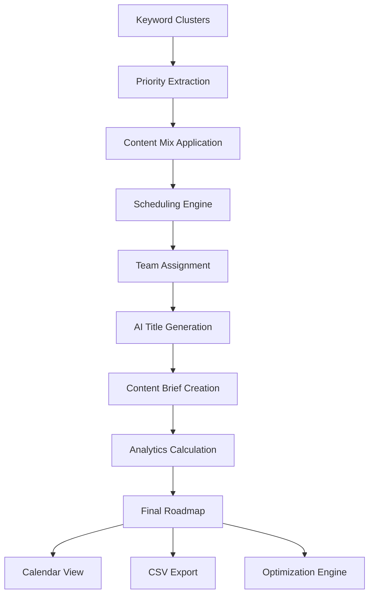

# Editorial Roadmap Generation Service

The Editorial Roadmap Generation Service is a comprehensive content planning system that transforms prioritized keyword clusters into actionable editorial calendars with team assignments, AI-generated titles, and detailed content briefs.

## 🌟 Features

### Core Functionality
- **Intelligent Scheduling**: Mon-Thu publishing with holiday avoidance and buffer management
- **Content Mix Strategy**: 40% quick wins, 40% strategic tier-2, 20% pillar/evergreen
- **Team Assignment**: Round-robin workload balancing with specialty matching
- **AI-Powered Titles**: Batch title generation with fallback mechanisms
- **Content Briefs**: Detailed briefs for complex pillar and high-volume content
- **Export Flexibility**: Multiple formats (CSV, JSON) with customizable templates

### Advanced Planning
- **Publishing Rules**: Maximum posts per day/week with optimal distribution
- **Dependency Handling**: Pillar content spacing and supporting content sequencing  
- **Calendar Management**: Weekly, monthly, and quarterly calendar views
- **Progress Tracking**: Real-time progress updates during generation
- **Optimization Engine**: Actionable recommendations for roadmap improvement

## 📋 Quick Start

### Basic Usage

```typescript
import { RoadmapGenerationService } from './services/roadmap';

const service = new RoadmapGenerationService({
  anthropicApiKey: process.env.ANTHROPIC_API_KEY,
  defaultPostsPerMonth: 20,
  defaultDuration: 6,
  maxConcurrentTitleGeneration: 5,
  bufferDays: 2,
  holidayDates: ['2024-12-25', '2024-01-01'],
  workingDays: [1, 2, 3, 4] // Mon-Thu
});

// Generate roadmap from clusters
const roadmap = await service.generateRoadmap(
  'run-id-123',
  keywordClusters,
  {
    postsPerMonth: 25,
    startDate: '2024-03-01',
    duration: 6,
    pillarRatio: 0.3,
    quickWinPriority: true,
    teamMembers: [
      {
        name: 'Sarah Chen',
        email: 'sarah@company.com',
        role: 'writer',
        capacity: 10,
        specialties: ['tech', 'saas'],
        unavailable: ['2024-07-04']
      }
    ],
    contentTypes: [
      {
        type: 'blog_post',
        intents: ['informational'],
        minVolume: 0,
        maxDifficulty: 100,
        estimatedHours: 4,
        template: {
          titleFormat: 'How to {keyword}',
          structure: ['intro', 'main', 'conclusion'],
          wordCount: 1500,
          requiredSections: ['introduction']
        }
      }
    ]
  }
);
```

### API Integration

```typescript
// POST /api/roadmap/generate
const response = await fetch('/api/roadmap/generate', {
  method: 'POST',
  headers: { 'Content-Type': 'application/json' },
  body: JSON.stringify({
    runId: 'run-123',
    clusterIds: ['cluster-1', 'cluster-2'],
    config: generationConfig,
    options: {
      includeAnalytics: true,
      generateTitles: true,
      exportFormat: 'csv'
    }
  })
});

const { roadmap, exportUrl } = await response.json();
```

## 🏗️ Architecture

### Service Architecture

```
RoadmapGenerationService
├── Content Mix Application (40/40/20 strategy)
├── Scheduling Engine (Mon-Thu, holiday avoidance)
├── Team Assignment Engine (workload balancing)
├── AI Title Generation (batch processing with fallbacks)
├── Content Brief Generator (pillar + high-volume content)
└── Export System (CSV, JSON with custom templates)
```

### Data Flow



## 📊 Scheduling Logic

### Content Mix Strategy

The service applies a strategic content mix to maximize both quick wins and long-term authority:

- **40% Quick Wins**: Low-difficulty, decent volume keywords for immediate traffic
- **40% Strategic Tier-2**: Medium-difficulty keywords with growth potential
- **20% Pillar/Evergreen**: High-volume, comprehensive content for topical authority

### Publishing Rules

```typescript
interface PublishingRules {
  maxPostsPerDay: 2;
  maxPostsPerWeek: Math.ceil(postsPerMonth / 4.33);
  preferredPublishingDays: [1, 2, 3, 4]; // Mon-Thu
  blackoutDates: string[]; // Holiday dates
  minimumSpacing: 4; // hours between posts
  pillarContentSpacing: 14; // days between pillar posts
}
```

### Scheduling Algorithm

1. **Priority Sorting**: Pillar first, then quick wins (if enabled), then by blended score
2. **Date Assignment**: Find next available date respecting all constraints
3. **Capacity Checking**: Ensure daily/weekly limits not exceeded
4. **Spacing Validation**: Maintain minimum spacing, especially for pillar content
5. **Holiday Avoidance**: Skip blackout dates and non-working days

## 👥 Team Assignment System

### Assignment Strategy

The service uses a sophisticated assignment algorithm considering:

- **Workload Balance**: Even distribution across team capacity
- **Specialty Matching**: Match content topics with team member specialties
- **Availability**: Respect team member unavailable dates
- **Content Type Fit**: Match writers with appropriate content complexity

### Assignment Algorithm

```typescript
const assignmentScore = (loadScore * 0.7) + (specialtyScore * 0.3);

// Where:
// loadScore = (capacity - currentLoad) / capacity
// specialtyScore = hasSpecialtyMatch ? 1.0 : 0.3
```

## 🤖 AI Title Generation

### Batch Processing

Titles are generated in configurable batches to manage API costs and rate limits:

```typescript
const batchSize = config.maxConcurrentTitleGeneration; // Default: 5
const concurrentPromises = batch.map(generateSingleTitle);
const results = await Promise.allSettled(concurrentPromises);
```

### Fallback Mechanism

When AI generation fails, the service provides contextual fallbacks:

- **How-to Guide**: "How to {keyword}"
- **Listicle**: "Top 10 {keyword} Tips"
- **Comparison**: "{keyword}: Complete Comparison"
- **Default**: "Complete Guide to {keyword}"

### Title Selection Criteria

AI-generated titles are scored based on:
- Keyword inclusion (3 points)
- Optimal length 30-60 chars (2 points)
- Power words for intent (1 point)

## 📝 Content Brief Generation

### Brief Components

For pillar content and high-volume keywords (≥5000 volume), the service generates:

```typescript
interface ContentBrief {
  suggestedTitle: string;
  h1Suggestion: string;
  briefOutline: string[]; // 7-point structure
  targetWordCount: number; // Based on volume
  seoTips: string[]; // SEO optimization guidance
  internalLinkingSuggestions: string[]; // Cross-linking opportunities
  competitorAnalysis: string; // SERP analysis summary
  estimatedDifficulty: 'beginner' | 'intermediate' | 'advanced';
  requiredResources: string[]; // Additional resources needed
}
```

### Outline Structure

Standard content brief outline:
1. Introduction and overview
2. Key concepts and definitions
3. Step-by-step guidance
4. Best practices and tips
5. Common mistakes to avoid
6. Tools and resources
7. Conclusion and next steps

## 📈 Analytics & Insights

### Roadmap Analytics

```typescript
interface RoadmapAnalytics {
  totalEstimatedTraffic: number; // 30% CTR assumption
  quickWinCount: number;
  avgDifficulty: number;
  intentDistribution: Record<KeywordIntent, number>;
  stageDistribution: Record<RoadmapStage, number>;
  monthlyDistribution: MonthlyMetrics[];
  driWorkload: TeamWorkload[];
  contentTypes: ContentTypeDistribution[];
}
```

### Key Metrics Tracked

- **Traffic Potential**: Estimated monthly organic traffic
- **Content Balance**: Pillar vs. supporting content ratio
- **Team Utilization**: Hours and assignments per team member
- **Quick Win Opportunity**: Percentage of low-hanging fruit
- **Difficulty Assessment**: Average competition level
- **Intent Distribution**: Search intent breakdown

## 📤 Export System

### Export Templates

1. **Editorial Roadmap**: Complete content calendar with assignments
2. **Content Calendar**: Schedule-focused view by week/month/quarter
3. **Team Assignments**: DRI-focused workload distribution
4. **Quick Wins Report**: Priority list of easy-to-rank opportunities
5. **Custom**: User-defined field combinations

### Export Formats

- **CSV**: Maximum compatibility, Excel-ready
- **JSON**: API integration and custom processing
- **Excel**: Advanced formatting with multiple sheets (future)

### CSV Schema Example

```csv
post_id,cluster_label,stage,primary_keyword,secondary_keywords,intent,volume,difficulty,blended_score,quick_win,suggested_title,dri,due_date,notes,source_urls,run_id
pillar-marketing-automation-001,Marketing Automation,pillar,marketing automation,"email automation,lead nurturing",commercial,5000,45,0.85,false,"Complete Marketing Automation Guide",Sarah Chen,2024-03-15,"Comprehensive guide needed - 3000+ words",https://competitor1.com,run-123
```

## 🎯 Optimization Engine

### Optimization Areas

The service identifies improvement opportunities in:

1. **Content Gap Analysis**: Insufficient pillar content ratios
2. **Timing Optimization**: Quick wins should be prioritized earlier
3. **Assignment Balance**: Uneven workload distribution
4. **Prioritization**: Suboptimal content sequencing
5. **Clustering Issues**: Poor keyword-to-content mapping

### Optimization Scoring

```typescript
interface OptimizationImprovement {
  type: string; // improvement category
  description: string; // what to improve
  impact: number; // 1-10 potential impact
  effort: number; // 1-10 implementation effort
  roi: number; // impact/effort ratio
  actionItems: string[]; // specific steps
}
```

Improvements are ranked by ROI (impact/effort ratio) for maximum efficiency.

## 🔧 Configuration Options

### Service Configuration

```typescript
interface RoadmapServiceConfig {
  anthropicApiKey: string; // Required for AI features
  defaultPostsPerMonth: number; // Default: 20
  defaultDuration: number; // months, Default: 6
  maxConcurrentTitleGeneration: number; // Default: 5
  bufferDays: number; // Default: 2
  holidayDates: string[]; // ISO date strings
  workingDays: number[]; // 1-7, Default: [1,2,3,4]
}
```

### Generation Configuration

```typescript
interface RoadmapGenerationConfig {
  postsPerMonth: number; // 1-100
  startDate: string; // ISO date
  duration: number; // months, 1-24
  pillarRatio: number; // 0.1-0.9, recommended: 0.2-0.4
  quickWinPriority: boolean; // prioritize quick wins
  teamMembers: TeamMember[];
  contentTypes: ContentTypeConfig[];
  seasonalAdjustments?: SeasonalAdjustment[];
}
```

## 🚀 Performance & Scalability

### Performance Benchmarks

- **Small Scale** (5 clusters, 50 keywords): <5 seconds
- **Medium Scale** (20 clusters, 200 keywords): <15 seconds  
- **Large Scale** (50 clusters, 500+ keywords): <30 seconds
- **Memory Usage**: ~50MB for 1000 keywords
- **API Calls**: ~1 call per 5 items for title generation

### Scalability Features

- **Batch Processing**: AI operations processed in configurable batches
- **Rate Limiting**: Built-in respect for API rate limits
- **Progress Tracking**: Real-time updates for long-running operations
- **Fallback Mechanisms**: Graceful degradation when services fail
- **Caching**: Intelligent caching of AI responses (future)

### Cost Optimization

- **AI Usage**: ~$0.001-0.003 per title generated
- **Fallback Titles**: Zero cost when AI unavailable
- **Batch Efficiency**: Reduced API overhead
- **Smart Caching**: Avoid regenerating identical requests

## 📚 API Reference

### Core Methods

#### `generateRoadmap(runId, clusters, config, onProgress?)`
Generates complete editorial roadmap from keyword clusters.

**Parameters:**
- `runId`: Unique identifier for the generation run
- `clusters`: Array of keyword clusters with analytics
- `config`: Generation configuration object
- `onProgress`: Optional callback for progress tracking

**Returns:** `Promise<EditorialRoadmap>`

#### `exportToCsv(roadmap, options?)`
Exports roadmap to CSV format with customizable options.

**Parameters:**
- `roadmap`: Generated editorial roadmap
- `options`: Export formatting and filtering options

**Returns:** `EditorialRoadmapCSV[]`

#### `createContentCalendar(roadmap, view?, filters?)`
Creates calendar view of roadmap content.

**Parameters:**
- `roadmap`: Generated editorial roadmap
- `view`: 'week' | 'month' | 'quarter'
- `filters`: Optional filtering criteria

**Returns:** `ContentCalendar`

#### `optimizeRoadmap(roadmap)`
Analyzes roadmap and provides optimization recommendations.

**Parameters:**
- `roadmap`: Generated editorial roadmap

**Returns:** `Promise<RoadmapOptimization>`

### API Endpoints

#### `POST /api/roadmap/generate`
Generate editorial roadmap from clusters.

#### `GET /api/roadmap/calendar`
Get calendar view with filtering options.

#### `POST /api/roadmap/export`
Export roadmap in various formats.

## 🧪 Testing

### Test Coverage

- **Unit Tests**: Core business logic (85%+ coverage)
- **Integration Tests**: End-to-end roadmap generation
- **API Tests**: HTTP endpoint validation
- **Performance Tests**: Scalability benchmarks
- **Error Handling**: Graceful failure scenarios

### Running Tests

```bash
# Run all roadmap tests
npm test -- roadmap

# Run integration tests only
npm test -- roadmap-integration

# Run with coverage report
npm test -- --coverage roadmap
```

### Test Scenarios

- Small/medium/large cluster datasets
- Various team configurations  
- AI service failures and recovery
- Export format validation
- Calendar generation accuracy
- Optimization recommendation quality

## 🔍 Monitoring & Debugging

### Key Metrics to Monitor

- **Generation Success Rate**: % of successful roadmap generations
- **Processing Time**: P50/P95/P99 generation times
- **AI Success Rate**: % of successful title generations
- **Export Success Rate**: % of successful exports
- **Team Utilization**: Average workload balance score

### Debugging Tools

- **Progress Tracking**: Real-time generation status
- **Error Categorization**: Structured error reporting
- **Performance Profiling**: Step-by-step timing analysis
- **Data Validation**: Input validation and sanitization
- **Fallback Monitoring**: Fallback mechanism usage rates

### Logging Strategy

```typescript
// Progress logging
console.log(`Roadmap generation progress: ${progress.stage} - ${progress.currentStep}`);

// Performance logging  
Sentry.addBreadcrumb({
  category: 'roadmap_generation',
  message: 'Roadmap generated successfully',
  data: { itemCount, processingTime, pillarRatio }
});

// Error logging
Sentry.captureException(error, {
  tags: { service: 'roadmap', operation: 'title_generation' },
  contexts: { item: { postId, keyword } }
});
```

## 🛠️ Troubleshooting

### Common Issues

#### "Team capacity must be at least equal to posts per month"
**Solution**: Increase team member capacity or reduce postsPerMonth in config.

#### "No valid clusters found for roadmap generation"
**Solution**: Ensure cluster IDs exist and clusters contain keywords.

#### "Title generation failed: Rate limit exceeded"
**Solution**: Reduce maxConcurrentTitleGeneration or implement longer delays.

#### Empty roadmap generated
**Solution**: Check cluster data quality and filtering criteria.

### Performance Issues

#### Slow generation (>30 seconds)
- Reduce cluster count or keyword volume
- Optimize team assignment algorithm
- Implement result caching

#### High memory usage
- Process clusters in smaller batches
- Clear intermediate data structures
- Implement streaming for large exports

### AI Integration Issues

#### Inconsistent title quality
- Adjust title selection criteria
- Implement custom scoring weights
- Use fallback titles more aggressively

#### High AI costs
- Implement more aggressive caching
- Reduce concurrent API calls
- Use fallbacks for low-priority content

## 🔮 Future Enhancements

### Planned Features

- **Advanced AI Integration**: GPT-4 integration for enhanced briefs
- **Multi-language Support**: International content planning
- **SEO Tool Integration**: Ahrefs/SEMrush data enrichment
- **Visual Calendar**: Interactive calendar interface
- **Automated Publishing**: Direct CMS integration
- **Performance Tracking**: ROI measurement and optimization

### Enhancement Roadmap

**Q2 2024**: Advanced export formats, seasonal optimization
**Q3 2024**: Multi-language support, enhanced AI integration  
**Q4 2024**: Visual interface, automated publishing
**Q1 2025**: Performance tracking, advanced analytics

---

## 🤝 Contributing

1. Fork the repository
2. Create feature branch: `git checkout -b feature/roadmap-enhancement`
3. Add tests for new functionality
4. Ensure all tests pass: `npm test`
5. Submit pull request with detailed description

## 📄 License

This service is part of the Dream 100 Keyword Engine project. See main project LICENSE for details.

---

**Need Help?** Check our [troubleshooting guide](#-troubleshooting) or [open an issue](https://github.com/your-repo/issues) with detailed information about your use case.